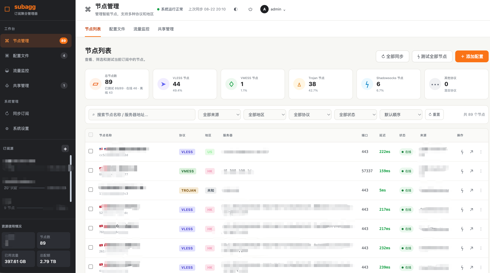
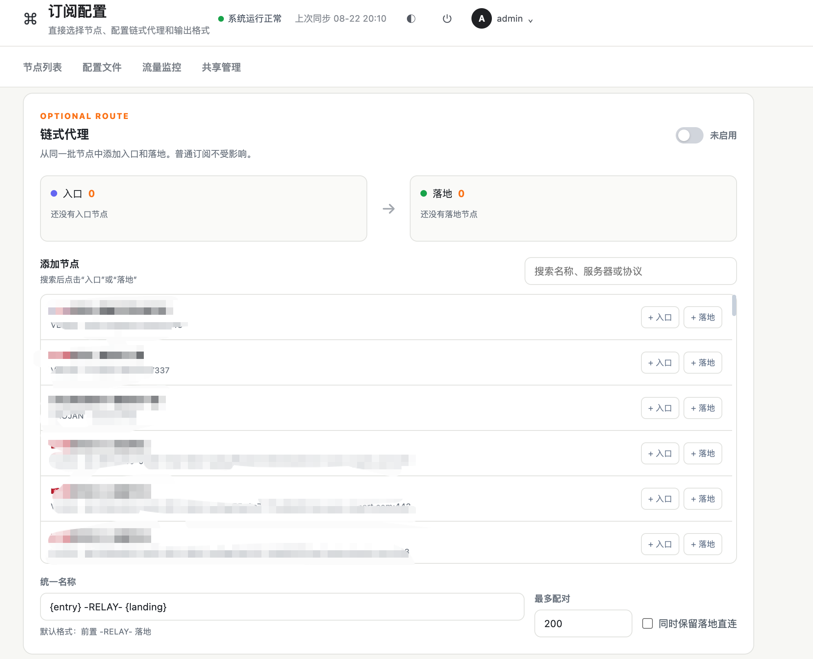

<div align="center">

# subagg

**Self-hosted proxy subscription aggregator.**

One link that adapts to whatever client asks for it.

[中文文档](./README.zh-CN.md) · [Security](./SECURITY.md) · [Contributing](./CONTRIBUTING.md)

[](./LICENSE)
[](https://nodejs.org)

</div>

---

## What it does

You have several proxy subscriptions. Each gives you a link. Each link works with
some clients and not others. Your laptop runs Clash, your phone runs Shadowrocket,
and the friend you share nodes with runs something else entirely.

subagg merges them into **one link**:

```
several upstream subscriptions
        │
        ▼  fetch, parse into one node model
   filter rules  (region / protocol / regex / manual picks / dedupe / rename)
        │
        ▼
   https://your-host/sub/<token>
        │
        ├─ Clash asks       → YAML with proxy groups and rules
        ├─ Shadowrocket asks → base64 URI list
        └─ v2rayN asks       → base64 URI list
```

The format is chosen from the client's `User-Agent`. Add `?target=clash.meta`
to force one.

## Features

- **Multi-source aggregation** — Clash YAML and base64 URI-list subscriptions,
  auto-detected. Protocols: VMess, VLESS (incl. REALITY), Trojan, Shadowsocks,
  ShadowsocksR, Hysteria2, TUIC.
- **One link, many clients** — Clash / Clash.Meta (mihomo) / Shadowrocket / v2rayN,
  picked automatically by User-Agent.
- **Filter rules decoupled from output format** — the same rule set produces every
  format. Filter by region, protocol, source, regex include/exclude, or hand-pick
  nodes in the UI. Plus dedupe, rename templates, sorting and limits.
- **Nothing is dropped silently** — nodes your client can't support (VLESS on stock
  Clash, for example) are reported in the response headers and the UI, with the reason.
- **Traffic monitoring** — parses `Subscription-Userinfo` from each upstream, keeps
  history, and re-emits an aggregated header so your client shows a usage bar.
- **Sharing** — issue a separate, individually revocable token per friend, and see
  the real access log (when, which client, how many distinct sources).

## Screenshots

### Node management

Filter, inspect, and test every node in one compact workspace. The included
example has been redacted before publication.



### Chain proxy configuration

Choose entry and landing nodes for an optional relay route, while keeping the
normal subscription unchanged.



## Quick start

Requires Node.js ≥ 20.11.

```bash
git clone https://github.com/your-org/subagg.git
cd subagg
npm install

cp .env.example .env
echo "ADMIN_TOKEN=$(openssl rand -hex 32)" >> .env
echo "IP_HASH_SALT=$(openssl rand -hex 16)" >> .env

npm run build
npm start
```

Open <http://127.0.0.1:8787>, paste your `ADMIN_TOKEN`, add a subscription.

For development use `npm run dev` (watch mode via tsx).

> **Before exposing this to the internet, read [SECURITY.md](./SECURITY.md).**
> The database holds your proxy credentials. It needs HTTPS, and the admin API
> should not be publicly reachable.

Deployment: a [systemd unit](./scripts/subagg.service) for plain VPS installs,
and a [Dockerfile](./Dockerfile) / [compose file](./docker-compose.yml) if you
prefer containers.

## Using the subscription link

```bash
# Same URL, three clients, three formats
curl -A "ClashforWindows/0.20.39" https://your-host/sub/$TOKEN   # → YAML
curl -A "Shadowrocket/2.2.31"     https://your-host/sub/$TOKEN   # → base64
curl -A "v2rayN/6.45"             https://your-host/sub/$TOKEN   # → base64

# Force a format
curl "https://your-host/sub/$TOKEN?target=clash.meta"

# See what happened without downloading the body
curl -sI https://your-host/sub/$TOKEN
```

Response headers worth knowing:

| Header | Meaning |
|---|---|
| `Subscription-Userinfo` | Aggregated traffic; this is what draws the usage bar in your client |
| `Profile-Update-Interval` | How often the client should refetch |
| `X-Subagg-Nodes` | How many nodes went into the config |
| `X-Subagg-Target` | Which format was chosen, and why (`ua` / `query` / `default`) |
| `X-Subagg-Skipped` | How many nodes the target format can't represent |
| `X-Subagg-Warning` | Anything else you should know |

## A note on Clash vs Clash.Meta

Stock Clash (the Dreamacro core, used by ClashX, Clash for Windows, Clash for Android)
**does not support VLESS, Hysteria2 or TUIC**. Clash.Meta / mihomo does.

subagg detects which one you're running and drops the nodes your core can't handle —
because emitting them would make the client reject the *entire* config, not just those
nodes. The count and reason come back in `X-Subagg-Skipped`. If you see nodes going
missing, that's usually why, and the fix is a Meta-based client (Clash Verge Rev, Stash,
FlClash…).

## What subagg cannot do

**It cannot measure how much traffic a friend used.** Their proxy traffic goes
straight from their device to the proxy server; it never passes through subagg.

The only thing observable here is that their client *fetched the subscription* —
so that is exactly what the UI shows: fetch count, timestamps, detected client,
and number of distinct source IPs (a genuine signal for "has this link been forwarded?").
There is deliberately no "estimated usage" figure anywhere, because any such number
would be fabricated. For real numbers, check your provider's dashboard.

## Architecture

```
src/core/       pure functions — no IO, fully unit-tested
  parse/        subscription formats → one node model
  filter.ts     the rule engine
  emit/         node model → client formats, plus the capability matrix
src/db/         SQLite persistence
src/services/   fetch, sync, schedule, render
src/server/     HTTP: /sub/:token (public) and /api/* (authenticated)
public/         zero-build frontend — plain ES modules, no bundler
```

The `core/` layer is deliberately IO-free. Protocol parsing and config generation
are where the bugs live, and keeping side effects out means every branch is
reachable from a unit test. The most important of those tests asserts
`parseUri(emitUri(node)) === node` for every protocol — URI dialects differ in ways
no code review will catch.

## Development

```bash
npm run lint
npm run typecheck
npm test
```

See [CONTRIBUTING.md](./CONTRIBUTING.md) — especially if you're adding an output
format or a protocol.

## Roadmap

Not in v1, but the seams are there:

- sing-box JSON output (`emit/` is structured for it; add a file, register it)
- Surge / Quantumult X output
- Node latency testing and speed-based sorting
- Inheriting upstream `rules` / `proxy-groups`

## License

[MIT](./LICENSE)
